# ☕ Coffee Demand Intelligence Dashboard

### Data-Driven Forecasting & Peak Demand Prediction for Afficionado Coffee Roasters


---

## 📖 Project Overview

This project focuses on building a data-driven forecasting system to analyze and predict coffee sales demand across multiple store locations.

Coffee retail demand is highly dynamic, with fluctuations driven by time of day, location, and customer behavior. This system leverages historical transaction data to forecast future demand, identify peak hours, and support better operational planning.

The goal is to shift from intuition-based decision-making to a structured, data-driven approach for improving efficiency and customer experience.

---

## 🚀 Key Highlights

✔ Real-world retail forecasting problem

✔ Multi-store demand prediction

✔ Time-series + Machine Learning approach

✔ Interactive Streamlit dashboard

✔ Business-focused insights and KPIs

---

## 🎯 Objectives

### Primary Objectives

* Forecast daily and hourly sales demand per store
* Predict future revenue trends
* Identify peak demand periods

### Secondary Objectives

* Reduce inventory wastage
* Improve staff scheduling accuracy
* Enable store-level decision-making

---

## 📊 Dataset Description

The dataset contains transactional-level data with the following key features:

* **transaction_id** – Unique transaction identifier
* **transaction_time** – Time of purchase
* **transaction_qty** – Quantity sold
* **unit_price** – Price per unit
* **store_id / store_location** – Store information
* **product_category / product_type / product_detail** – Product attributes

---

## ⚙️ Methodology

### 1. Data Processing

* Aggregated transaction data at:

  * Hourly level (for demand patterns)
  * Daily level (for forecasting)
* Handled missing values and ensured continuous time series

---

### 2. Feature Engineering

* Lag features (previous day/hour demand)
* Rolling averages (3-day, 7-day trends)
* Time-based features:

  * Hour of day
  * Day of week
* Store-level segmentation

---

### 3. Forecasting Approach

* Baseline model for comparison
* Gradient Boosting Regression for improved accuracy
* Time-based train-test split (no random shuffling)

---

### 4. Model Evaluation Metrics

* **MAE (Mean Absolute Error)** – Measures average error
* **RMSE (Root Mean Squared Error)** – Penalizes large deviations
* **MAPE (Mean Absolute Percentage Error)** – Relative accuracy
* **Peak Demand Capture Rate** – Identifies high-demand periods

---

## 🧠 How It Works

1. Raw transaction data is aggregated into hourly and daily time series
2. Feature engineering captures temporal patterns (lags, rolling averages)
3. Machine learning model predicts future demand
4. Results are visualized through an interactive dashboard
5. Business insights are generated for decision-making

---

## 📈 Dashboard Features (Streamlit)

### 🔹 Forecast & Evaluation

* Forecast vs Actual comparison
* Model performance comparison
* KPI metrics display

### 🔹 Uncertainty & Planning

* Confidence interval visualization
* Best-case and worst-case scenarios

### 🔹 Demand Analysis

* Demand spike detection
* Hourly demand pattern analysis
* Heatmap for store-wise hourly demand

### 🔹 KPI Definitions

- **Forecast Accuracy (%)** = 100 − MAPE  
- **Peak Demand Capture Rate** = % of correctly identified peak periods  
- **MAE** = Average absolute error  
- **RMSE** = Penalizes larger errors more than MAE  

### 🔹 Business Insights

* Category-level sales analysis
* Store performance comparison

### 🔹 User Controls

* Store selection filter
* Forecast horizon slider
* Revenue vs Quantity toggle
* Model selection option

---

## 📸 Dashboard Preview

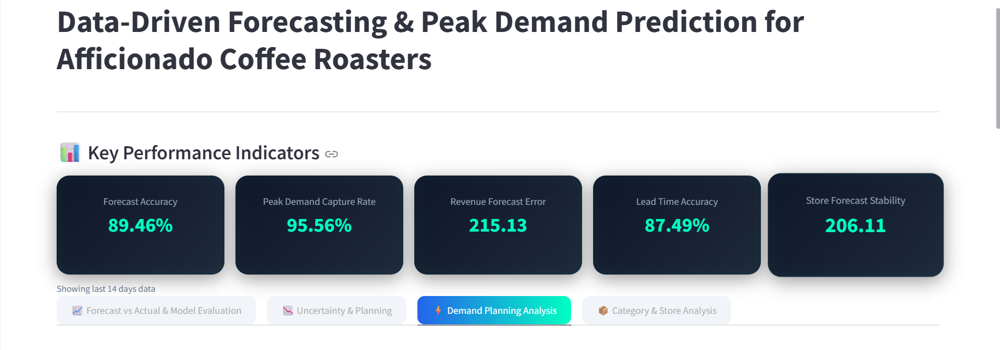
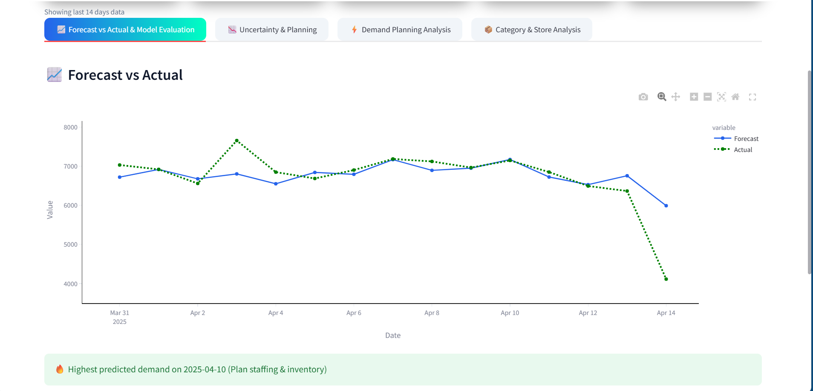
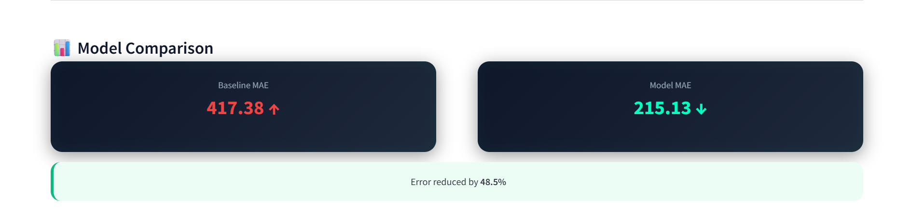
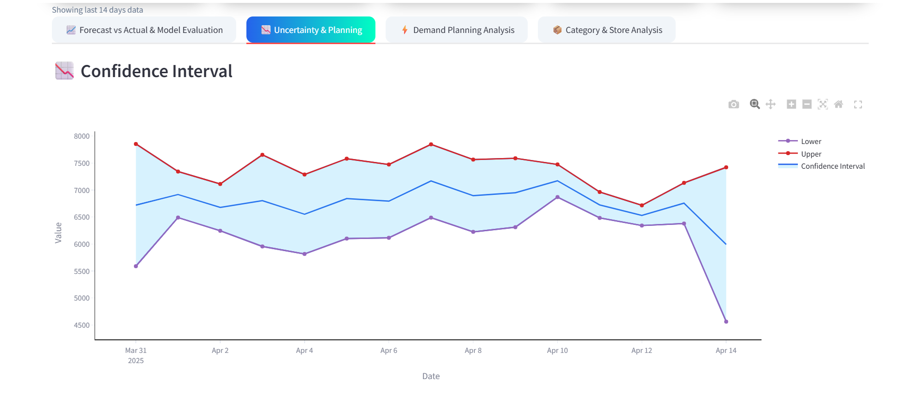
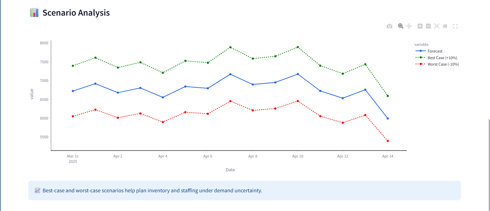
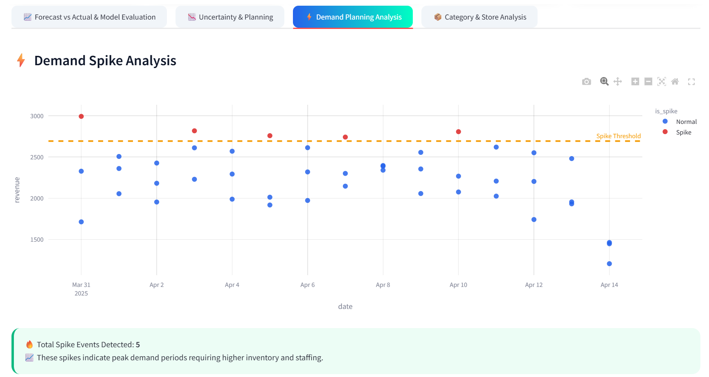
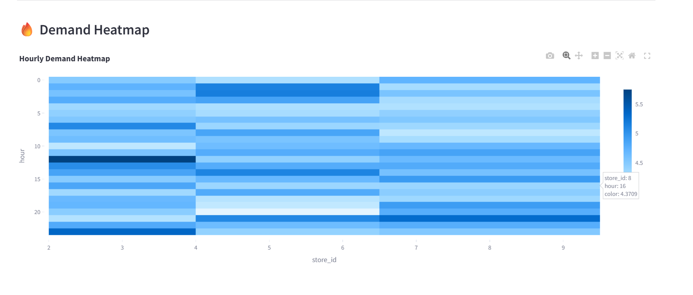
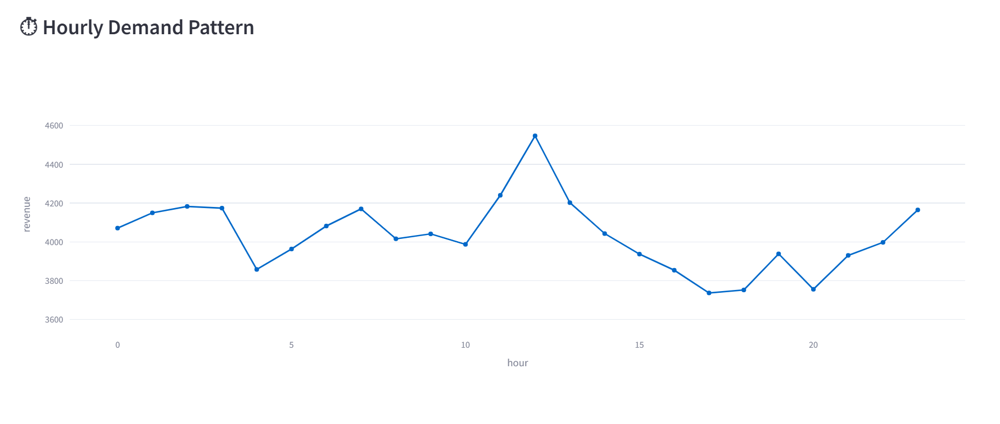
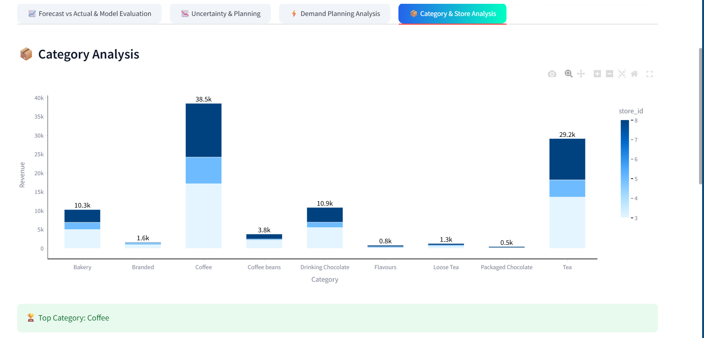
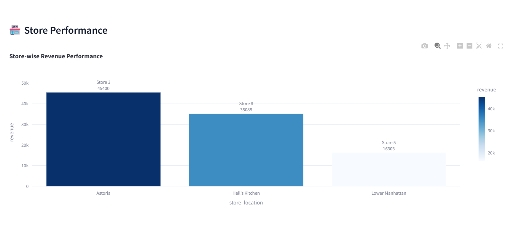
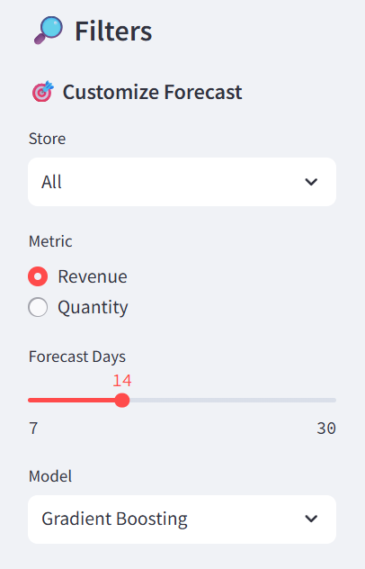

---

## 📊 Key Results

* Forecast Accuracy: **~89%**
* Peak Demand Detection Rate: **~95%**
* Model significantly outperformed baseline approach
* Identified high-demand periods for better planning

---

## 💼 Business Impact

* Enables proactive inventory management
* Improves workforce planning during peak hours
* Reduces overstocking and wastage
* Supports location-specific decision-making

---

## 🛠 Tech Stack

* **Programming:** Python
* **Data Analysis:** Pandas, NumPy
* **Machine Learning:** Scikit-learn
* **Visualization:** Plotly
* **Dashboard:** Streamlit

---

## 🚀 Live Demo

🔗 Streamlit App: https://coffee-demand-intelligence-pbyne4ynxeuzqr5w7keuhb.streamlit.app/

🔗 GitHub Repository: https://github.com/Kdsingh82405/coffee-demand-intelligence

🔗 Research Paper (DOI): https://doi.org/10.5281/zenodo.19437138

---

## ▶️ How to Run the Project

```bash
pip install -r requirements.txt
streamlit run app.py
```

---

## 📁 Project Structure

```bash
coffee-demand-intelligence/
 ┣ app.py
 ┣ data/
 ┃ ┣ coffee_data.csv
 ┃ ┗ forecast_results.csv
 ┣ assets/
 ┃ ┣ images...
 ┣ docs/
 ┃ ┗ research_paper.pdf
 ┣ README.md
```

---

## 🔮 Future Improvements

* Integrate deep learning models (LSTM)
* Add real-time data streaming
* Include external factors (weather, holidays)
* Automate model retraining

---

## 👤 Author

**Kundan Kumar Singh**

🎓 MCA Student | Data Analyst

🔗 GitHub: https://github.com/Kdsingh82405

---

## 📌 Conclusion

This project demonstrates how data-driven forecasting can transform retail operations by providing actionable insights into demand patterns. By combining time-series analysis, machine learning, and interactive visualization, the system enables businesses to make informed and efficient decisions.

---
